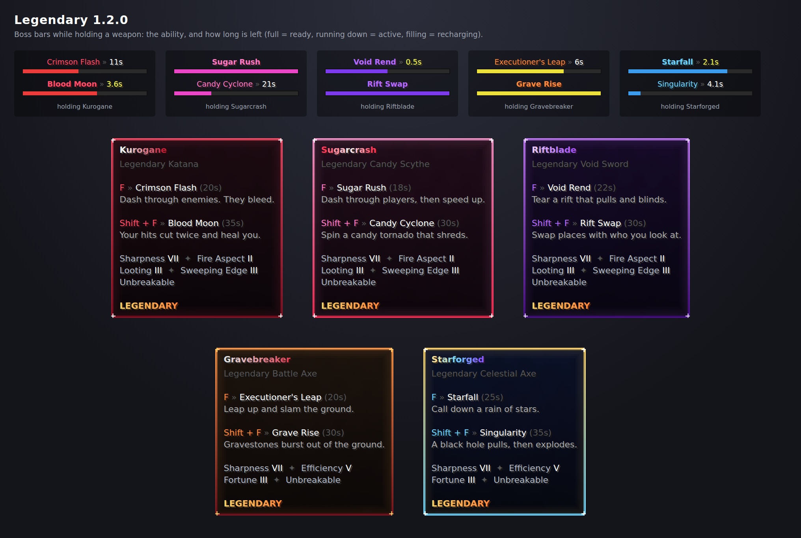

# Legendary

Five legendary netherite weapons for **ᴠᴀɴɪʟʟᴀ sᴍᴘ**, each with its own playstyle. Every
weapon is tracked one by one, so it cannot be duplicated, stored away, or passed between alt
accounts. For Paper 1.21 and newer.

**Controls:** **F** (the swap-offhand key) uses a weapon's first ability and **Shift + F** its
second; the weapon stays in your hand. `controls: right-click` in `config.yml` switches back to
right-click and sneak + right-click (or `both`), and the lore always shows the right keys.

**Cooldowns are boss bars.** While you hold a legendary, a boss bar for each of its abilities
sits at the top of the screen, in the weapon's colour: just the ability's name when it is
ready (a full bar), `Crimson Flash » 11s` while it recharges (the bar fills up), and the time
left while it lasts, such as Blood Moon (the bar runs down). Nothing is said in chat or above
the hotbar when you press too early: the bar flashes white. The action bar is left to the
Combat plugin's timer. `display.boss-bars: false` turns them off.



## The weapons

The swords (Kurogane, Sugarcrash, Riftblade) have **Sharpness VII, Fire Aspect II, Looting III
and Sweeping Edge III**; the axes (Gravebreaker, Starforged) **Sharpness VII, Efficiency V and
Fortune III**. All five are unbreakable netherite with a custom name and short lore: each
ability with its key and cooldown, and the enchantments listed in the weapon's own colours.

They look like 1.21.11 items: with the server resource pack each has its own 3D model
(`item-model`), its own tooltip frame and background in its colours (`tooltip-style`, 1.21.2+),
and no old purple enchantment shimmer (`glint: false`), since the models have their own glowing
parts. Custom model data (1001 to 1005) is still set for older clients.

Every ability has its own 3D effect from the pack (crimson slashes, candy rings, a void rift, a
shockwave, gravestones, a rune circle, falling stars, a black hole...), shown with display
entities: the server says where an effect starts and ends, and the players' game animates it
smoothly in between. Effects are never saved with the world. Every ability and hit also has its
own sound from the pack, with a quiet vanilla sound under it for players without the pack.

### Kurogane (katana): precision and sustained combat

- **Crimson Flash** (F, 20s): an iaido dash. You vanish in a crimson streak and reappear up
  to 8 blocks ahead (stopping before walls, never inside them). Half a second later everyone
  you passed through is cut for 7 damage and bleeds for 1 damage a second for 3 seconds.
- **Blood Moon** (Shift + F, 35s): a crimson moon rises over your head for 6 seconds. Every
  sword hit cuts a second time for +3 damage and heals you half a heart. Spam clicks (hits less
  than 0.5s apart) do not cut twice.

### Sugarcrash (candy scythe): mobility and burst tempo

- **Sugar Rush** (F, 18s): a candy-streaked dash forward. Players you dash through take 4
  damage and are bowled aside. Then Speed II and Haste II for 5 seconds.
- **Candy Cyclone** (Shift + F, 30s): a candy-striped tornado spins around you for 3 seconds.
  Every half second, everyone within 4 blocks takes 1.5 damage and is dragged in. Then it
  bursts: 3 damage and everyone is thrown out.

### Riftblade (void sword): space and positioning

- **Void Rend** (F, 22s): tears a rift open 5 blocks ahead (or at a wall). For a second it
  drags everyone within 5 blocks towards it, then snaps shut: 7 damage and 2 seconds of
  Darkness for everyone within 3 blocks.
- **Rift Swap** (Shift + F, 30s): swap places with the first player (or monster) you look at
  within 18 blocks, through the void: they take 2 damage and 3 seconds of Nausea. With nobody
  in sight, it blinks you 10 blocks forward instead. It is a normal teleport, so safe zones and
  region plugins can refuse it; then nothing happens and the cooldown is not spent.

### Gravebreaker (battle axe): ground control and heavy hits

- **Executioner's Leap** (F, 20s): leap high and forward, then slam the ground where you land
  (no fall damage from it). Everyone within 5 blocks takes 8 damage at the centre down to 4 at
  the edge, is thrown up and gets Slowness II for 2 seconds. Rocks fly out of the crater, but
  no block is ever changed.
- **Grave Rise** (Shift + F, 30s): six gravestones burst out of the ground one after another
  in a 12-block line in front of you. Whoever stands on one takes 6 damage, is launched and gets
  Mining Fatigue II for 3 seconds (once per use). The line climbs single steps and stops at walls
  and drops.

### Starforged (celestial axe): area control and gravity

- **Starfall** (F, 25s): a rune circle opens where you look (up to 24 blocks) and turns for
  1.25s (never less than 0.5s), then six stars rain down inside it one after another. Each
  star hits everyone within 2 blocks of where it lands for 4 damage and launches them; one
  player is hit by at most 3 stars.
- **Singularity** (Shift + F, 35s): a black hole opens where you look. For 3 seconds it drags
  everyone within 7 blocks towards its heart (they can still walk out slowly; the first touch
  does 1 damage), then collapses into a nova: 6 damage and everyone is thrown away.
- While stars are falling no black hole can open and the other way round (plus 1.5s), so
  nobody can be held in place under the stars.

## Fair in PvP

- Ability damage is dealt in the attacker's name like a sword hit. Armour reduces it, kills
  give kill credit (Lifesteal hearts, death messages "slain by Steve using Kurogane"), and
  the Combat plugin tags both players.
- **Protected areas are respected.** If a protection plugin cancels the hit (no-PvP regions,
  claims, spawn), the player is not pushed, slowed, pulled or swapped either. Players in
  creative or spectator mode, vanished staff, and everyone in a world with PvP off are never hit.
- Each ability hits a target a set number of times per use (once for most; the Candy Cyclone
  every half second, at most 3 stars of a Starfall), and cooldowns belong to the weapon, so
  passing it to a friend, dropping it or reconnecting does not reset them.
- The dashes and swaps never put anyone inside a wall: they stop at the last open spot.
- With `controls: right-click`, right-click with food, potions, a bow, pearls and so on in the
  offhand uses that item and not the ability. A shield still works with abilities.
- Abilities also hit hostile mobs (`hit-mobs: hostile`, `all` or `none`).
- They work with the Vigil anti-cheat: ability hits are not melee attacks to it, and the
  knockback and launches are expected movement.

## Cannot be duplicated, stored or moved to alts

| Trying to... | What happens |
|---|---|
| Put it in a chest, ender chest, barrel, shulker box, hopper, dropper, dispenser, crafter, furnace, anvil, crafting grid, horse or minecart inventory, or a plugin menu | Refused: clicking, shift-clicking, number keys, the offhand key and dragging are all blocked |
| Put it in a bundle, item frame, armour stand, allay, decorated pot or shelf | Refused |
| Let a hopper or a mob (zombie, fox, allay...) pick it up | Refused |
| Craft with it (two swords repair into a plain one) | Refused |
| Sell or list it (`/sell`, `/ah sell`...) | Refused while it is in your hand; `/sellall` is refused while you carry one at all (`blocked-commands`). Other items can still be sold |
| Pass it to an alt (an account that joined from the same IP) | The alt cannot pick it up. Staff are alerted |
| Duplicate it (a dupe glitch, creative middle-click, an edited item) | Each weapon has a unique id. When two copies can be seen at once, the one the registry does not expect is deleted, and staff are alerted |
| Stash it somewhere from before the plugin | Opening that container (or joining with it in the ender chest) moves it back to the player |
| Keep it through death | It drops on the ground even with keepInventory, never into grave plugins |
| Lose it in lava, fire, cactus, explosions or the void | Dropped legendaries cannot be destroyed, never despawn, glow, and are moved to spawn if they fall into the void |

Every weapon's location is kept in `data.yml` (held by whom, or where on the ground), and
everything that happens to it is written to `history.log`. When `one-of-each: true`, only one
of each weapon can exist. A weapon that disappears for good (for example `/clear`) is marked
lost after 5 seconds, and staff are told it can be given out again. If the old copy ever turns
up, it is deleted.

## Commands

| Command | Permission | |
|---|---|---|
| `/legendary` | everyone | How the weapons work |
| `/legendary give <player> <weapon>` | `legendary.give` | Give a legendary (refused if one already exists) |
| `/legendary remove <player> <weapon\|all>` | `legendary.remove` | Take it away. Works on offline players: it disappears when they join |
| `/legendary remove * <weapon\|all>` | `legendary.remove` | Remove it wherever it is |
| `/legendary list` | `legendary.list` | Every legendary and where it is |
| `/legendary inspect <player>` | `legendary.inspect` | A player's legendaries, cooldowns and previous holder |
| `/legendary reload` | `legendary.reload` | Reload `config.yml`. Weapons already out update their name and lore |

Weapons: `kurogane`, `sugarcrash`, `riftblade`, `gravebreaker`, `starforged`. The command is
also `/lw` and `/legendaries`.

Other permissions: `legendary.admin` (all of the above, op by default), `legendary.alerts`
(duplicate, storage and alt alerts, op), and `legendary.bypass.alts` (may take a legendary
from an account on the same IP, for siblings; nobody by default).

## Configuration

Every number above is in `config.yml`: cooldowns, damage, ranges, widths, speeds, knockback,
effect levels and durations, and warning times. There are also the names, lore (with
`{crimson-flash.cooldown}`-style placeholders so it always matches, and `{enchantments}` for the
enchantment lines), enchantments, the boss bar colour and text colour of each weapon,
`custom-model-data`, `item-model`, `tooltip-style` and `glint`, every sound, and every message.
A wrong value falls back to its default and the console says what to fix.

**Without the resource pack**, the tooltip styles show as a missing texture. Either make the
pack required (`require-resource-pack=true` in `server.properties`) or set `tooltip-style: ""`
for each weapon.

**Updating from 1.1 or older:** nothing to do. On start the old abilities' settings, the action
bar settings and messages that no longer exist are removed, enchantments still at the old
default (Sharpness VI) become the new ones, and lore and names still worded exactly as an older
version shipped them are switched to the new text (and saved in `config.yml`). Anything you
changed yourself, such as your own enchantments or lore, is kept.

## Building and testing

```bash
cd legendary
mvn -B package   # runs the tests, writes target/Legendary-<version>.jar
```

`mvn test` runs 45 tests on a simulated server:
- **Every ability:** what it hits and when (Crimson Flash's delayed cut and bleeding, Blood
  Moon's spam-click gap and healing, the dash, tornado and burst, the rift's pull and snap,
  swapping and blinking, the slam's falloff and no fall damage, the gravestone line, the star
  warning and hit cap, the black hole and nova), walls, cooldowns and the Starforged lockout.
- **Protection:** protected players are never hurt, pulled or swapped; creative and PvP-off.
- **Look:** enchantments, item model, tooltip style, no glint, the lore's enchantment lines,
  the boss bars (names, times, progress, flashing, hidden when put away), and the 3D effects
  being cleaned up.
- **Storage:** blocking for every container type, bundles, armour stands, pots, hoppers, mobs
  and crafting.
- **Duplicates:** copies (which cannot use abilities), creative middle-click, revoked and lost
  weapons.
- **Ownership:** alt protection, death drops (keepInventory, grave plugins, cancelled
  deaths), and staff /invsee.
- **Controls:** F and Shift + F (the weapon stays in hand), the right-click and both settings,
  offhand food and shields, and the keys shown in the lore.
- **Other:** the registry across restarts, commands, config checking, upgrading a 1.1
  config, and updating old default texts while keeping your own.
